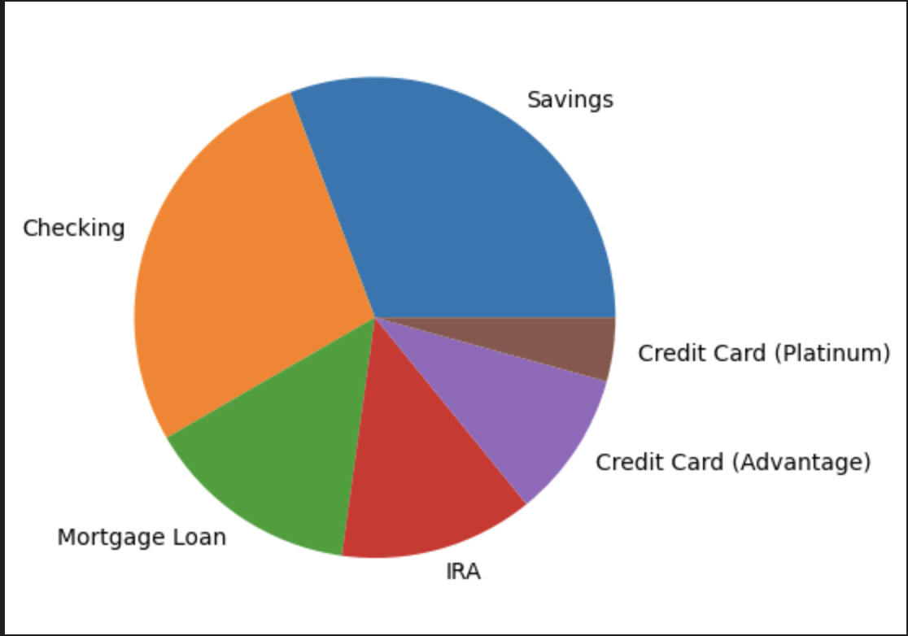
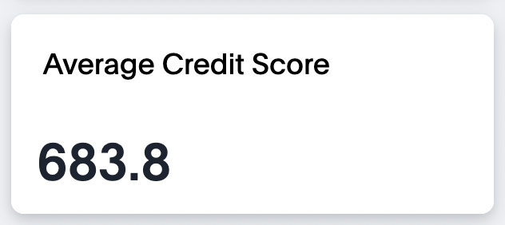
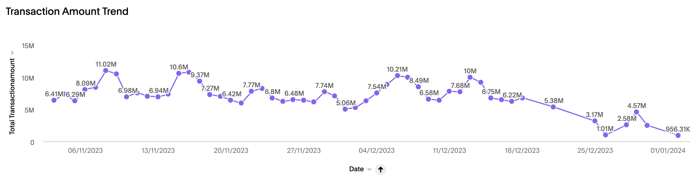
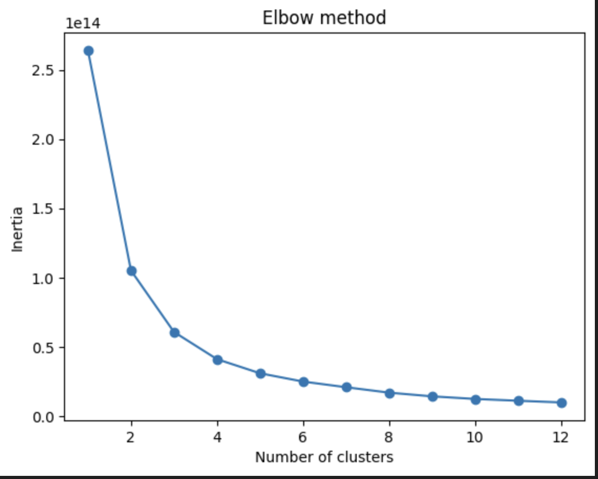
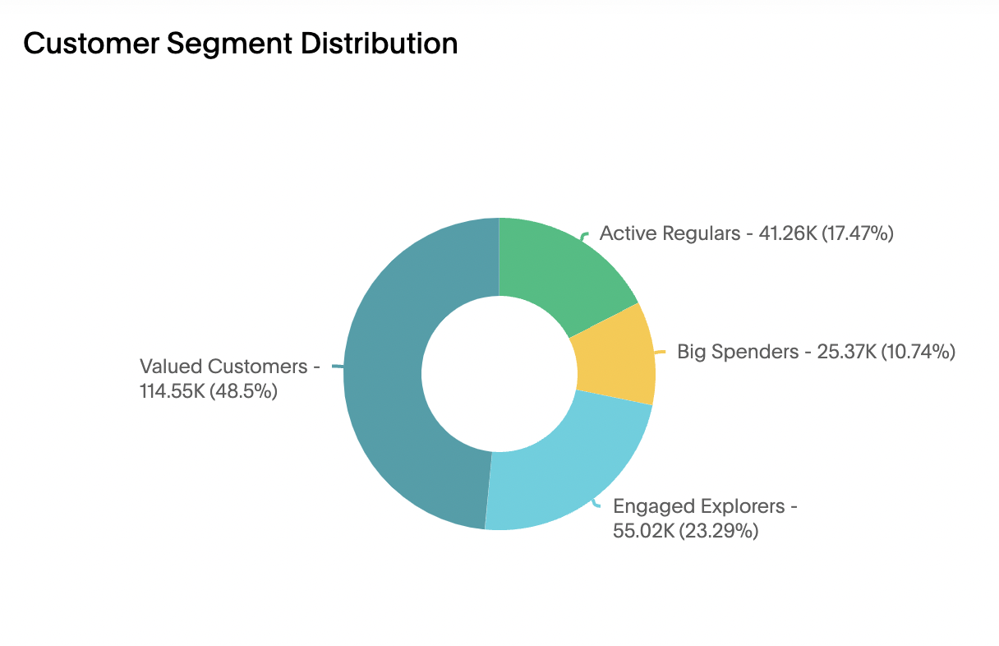
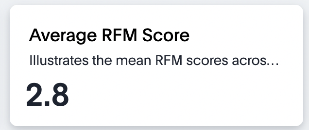
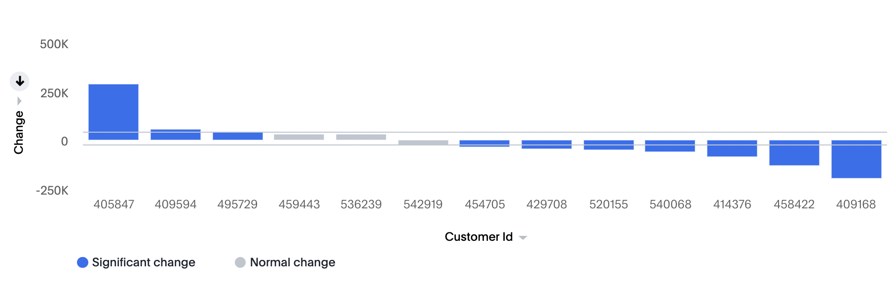

# python-loyalty-classification
Loyalty classification using python, BqML and Databricks ML

# Loyalty Classification with Python, BqML, Databricks ML, and ThoughtSpot
Customer segmentation and loyalty classification are vital for understanding and optimizing customer relationships. In this project, we explore different platforms, including Python, BqML (BigQuery Machine Learning), and Databricks ML, to perform loyalty classification and RFM (Recency, Frequency, Monetary) analysis. The results are then visualized using ThoughtSpot for enhanced interpretability and actionable insights.

## Overview
This repository contains the codebase for conducting loyalty classification and RFM analysis using Python, BqML, Databricks ML, and ThoughtSpot. Leveraging various platforms, we extract valuable insights from Banking and Transaction data to understand customer behavior.

## Approach
### Connection Establishment
We establish connections tailored to each platform. For Python, we utilize standard libraries. For BqML, we connect to Google BigQuery, and for Databricks ML, we establish connections specific to the Databricks environment.

### Data Selection
We meticulously select relevant datasets, including Retail Banking and Customer Transaction data, to kickstart our analysis across different platforms.

#### Banking Spectrum

 

#### Credit Score 

 

### Data Preparation
Data cleaning and preparation are performed to ensure suitability for analysis, irrespective of the platform. This includes handling missing values, standardizing formats, and merging various account data with transaction data.

#### A Strategic Exploration of Transaction Amount Trends

### Loyalty Classification
Utilizing the capabilities of Python, BqML, and Databricks ML, we implement robust loyalty classification algorithms. These algorithms assess customer behavior, identifying patterns that help categorize customers into loyalty segments.

#### Finding the Pinnacle with KMeans Elbow Chart

 

we employ a KMeans Clustering model to perform loyalty classification. To identify the optimal number of clusters, we evaluate inertias and leverage the elbow curve. The subsequent application of KMeans clustering unveils distinct customer segments based on their behaviors and interactions with the bank.

#### Customer Classification in the Digital Landscape

 

### RFM Analysis
Taking our analysis a step further, we conduct RFM analysis to evaluate the Recency, Frequency, and Monetary aspects of customer transactions. This analysis not only provides a snapshot of current customer engagement but also serves as a foundation for personalized and effective customer engagement strategies.

#### Unmasking Customer Scores in a KPI

 

### Visualization with ThoughtSpot

To translate our discoveries into actionable insights, we utilize ThoughtSpot for visualization across various platforms. ThoughtSpot's intuitive interface empowers stakeholders to interact with the data and derive meaningful insights for decision-making.

We establish live connections with Snowflake, BigQuery ML, and Databricks ML within ThoughtSpot, enabling us to create worksheets and liveboards dynamically. This approach facilitates interactive exploration and visualization of loyalty classification and RFM analysis results, empowering stakeholders to derive meaningful insights for decision-making.

## Results

The analysis yields comprehensive insights into customer behavior, enabling data-driven decision-making for marketing, engagement, and loyalty strategies. ThoughtSpot's visualizations enhance the interpretability of the findings, making them accessible for various stakeholders.

With SpotIQ change analysis, we can compare any two data points in a visualization for change and identify key change drivers from the underlying attribute columns.

#### SpotIQ Magic

 

**For a detailed guide on executing the analysis and reproducing the results, please refer to the code and documentation in this repository.**

## Guide to use .tml files
For step-by-step instructions on how to import .tml files into your ThoughtSpot cluster please refer [How to use TML files](https://docs.thoughtspot.com/cloud/latest/scriptability#_how_to_use_tml_files)

**Note:** Ensure that you have the necessary credentials and permissions for Snowflake and ThoughtSpot to execute this analysis successfully.

